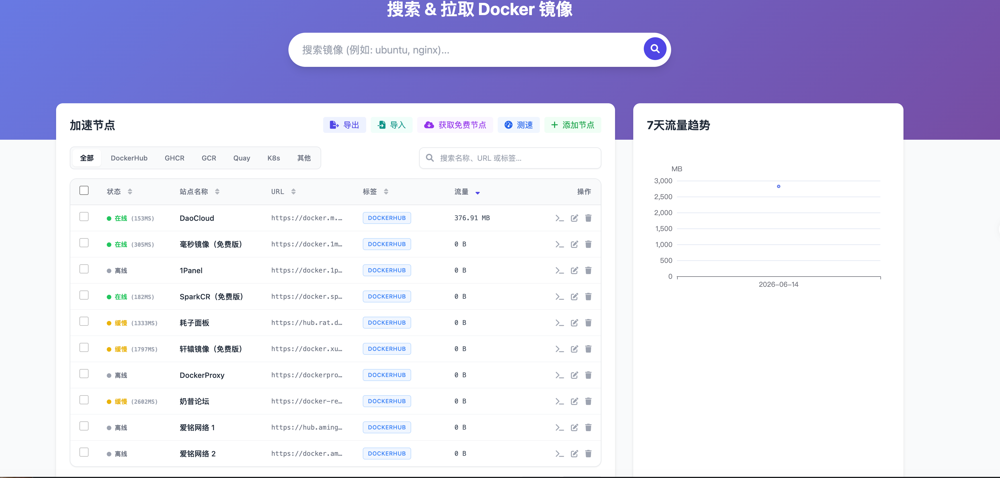
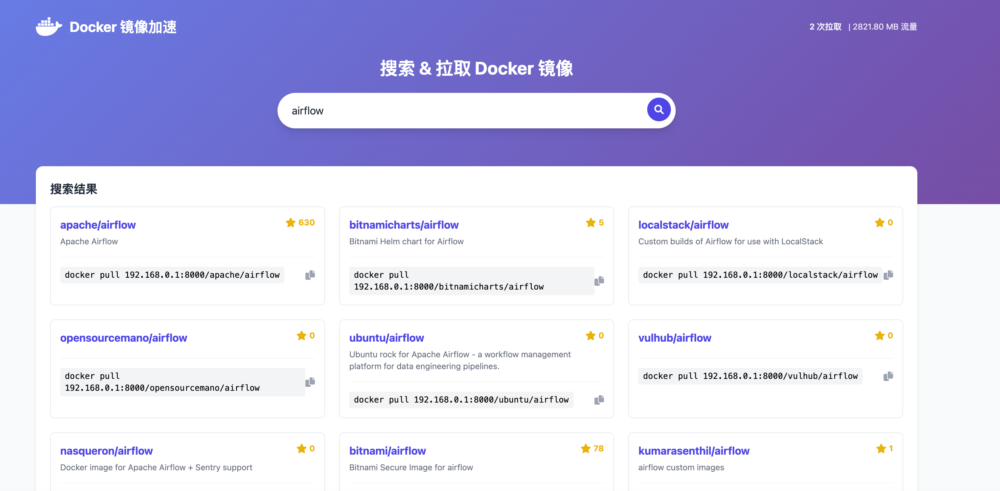
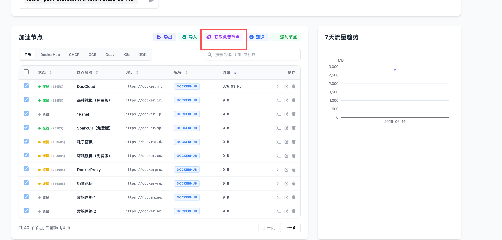
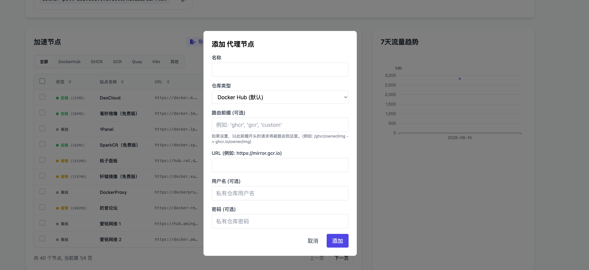
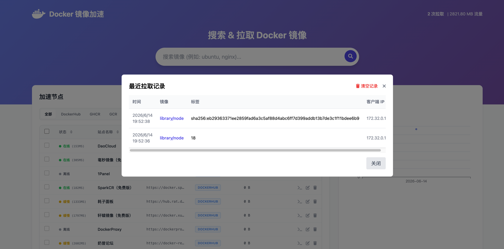

# Docker Hub Proxy & Mirror Manager

一个轻量级、智能的 Docker 镜像加速与代理管理工具。

它提供了一个现代化的 Web UI，用于管理上游镜像源（Mirrors），支持自动测速、延迟择优、流量统计以及一键获取免费代理节点。旨在解决国内拉取 Docker 镜像慢、超时等问题。

## ✨ 功能特性

*   **⚡️ 智能路由与加速**：
    *   定期对所有代理节点进行**自动测速**，并在拉取镜像时自动选择**延迟最低**的可用节点。
    *   支持**部分测速**和异步并发测速，实时在前端展示每个节点的测速状态。
    *   超时自动熔断：如果节点超时（>10s），自动标记为不可用，待恢复后自动启用。
*   **🌐 多源支持与快速筛选**：
    *   不仅支持 **Docker Hub**，还支持 **GHCR** (GitHub), **GCR** (Google), **Quay**, **K8s** 等镜像仓库的代理。
    *   提供前端 Tab 页快速分类切换，支持节点列表分页。
    *   支持自定义路由前缀（如 `/ghcr/` 转发到 `ghcr.io`）。
*   **🔐 访问管控与安全 (增强)**：
    *   **HTTPS 镜像代理**：默认通过 HTTPS 8443 端口拉取镜像，Web UI 单独使用 HTTP 8000 端口。
    *   **Web UI 鉴权**：支持通过配置 `ADMIN_USER` 和 `ADMIN_PASS` 保护控制面板。
    *   **IP 白名单**：支持配置 `IP_WHITELIST` 限制仅允许特定 IP 进行拉取，防止公网被刷流量滥用。
    *   **镜像过滤**：支持基于正则表达式的黑白名单（`IMAGE_WHITELIST_REGEX`, `IMAGE_BLACKLIST_REGEX`），精准控制允许代理拉取的镜像范围。
    *   **私有仓库免密**：配置账号密码后，本地客户端无需执行 `docker login` 即可直接拉取上游受保护的镜像。
*   **🆓 节点管理**：
    *   **一键获取免费节点**：内置爬虫功能一键抓取公开加速源，配有**无刷新异步并发测速**，加载进度直观可见。
    *   **实时搜索与智能状态**：内置多维度实时检索（名称/URL/标签），并根据测速延迟智能展示 🟢在线、🟡缓慢、⚪离线 状态指示灯。
    *   **交互式动态表格**：全新现代化的节点列表 UI，支持点击表头对延迟、流量、名称等任意字段进行**升降序排列**。
    *   **导入/导出配置**：支持将现有的节点列表一键导出为 JSON 文件，并快速导入备份。
*   **📊 流量统计与可视化**：
    *   集成 **ECharts**，直观展示近 7 天全局流量消耗趋势折线图。
    *   记录详细的拉取历史（包含时间、镜像、标签、客户端 IP）。
    *   **精细化单节点流量统计**：突破全局限制，实时精准记录每一个代理节点所承受的下载流量并展示在表格中，便于分析节点质量。

*   **🖥 界面展示**：






## 🚀 快速开始

### 方式一：Docker Compose 源码构建

1.  克隆本项目：
    ```bash
    git clone https://github.com/xingfeng7788/docker-hub-proxy.git
    cd docker-hub-proxy
    ```

2.  配置环境变量到.env：
    ```text
    certs/fullchain.pem
    certs/privkey.pem
    ```
    默认已经设置 `SSL_CERTFILE=./certs/fullchain.pem` 和 `SSL_KEYFILE=./certs/privkey.pem`，证书目录只读挂载，不会打包进镜像。必须放入实际证书文件；程序不会自动申请或生成证书。

    使用自签名证书时，还需要在拉取镜像的 Docker 客户端安装信任证书，完整步骤见 [HTTPS 自签名证书部署与排错](#3-https-自签名证书部署与排错)。

    如需修改面板密码、限制 IP 等，可选配置 `.env`（已有文件时保留现有配置）：
    ```bash
    cp .env.example .env
    # 编辑 .env 修改面板密码、限制 IP 等
    ```

3.  启动服务：
    ```bash
    docker compose up -d --build
    ```
    一个 `docker-compose.yml` 同时启动 Web UI 和镜像代理，共享 `data` 目录。无需创建 `.env` 即可使用默认配置；可选环境文件需要 Docker Compose 2.24.0+。

4.  访问 Web UI：
    打开浏览器访问 `http://localhost:8000`
    镜像代理地址为 `https://mirror.aibety.cn:8443`。8000 仅提供 Web UI 与管理 API，8443 仅提供镜像代理 `/v2/` 和认证 `/token`；Web UI 中生成的拉取命令使用代理域名和 8443 端口。

### 方式二：手动运行 (Python)

需要 Python 3.9+ 环境。

1.  安装依赖：
    ```bash
    pip install -r requirements.txt
    ```

2.  配置与运行：
    ```bash
    cp .env.example .env
    # 编辑 .env 文件
    
    # 分别在两个终端运行（证书目录与 Compose 部署相同）
    python -m app.main --service web
    python -m app.main --service proxy
    ```

### 方式三：快速部署（推荐）

#### 1.  docker-compose.yml

```bash
mkdir -p docker-hub-proxy/data docker-hub-proxy/certs
cd docker-hub-proxy
```

在此目录创建 `docker-compose.yml`，内容如下：

```yaml
x-common: &common
  image: ${DOCKER_IMAGE:-qq510023514/docker-hub:latest}
  env_file:
    - .env
  restart: unless-stopped

services:
  web-ui:
    <<: *common
    command: ["python", "-m", "app.main", "--service", "web"]
    ports:
      - "${WEB_PORT:-8000}:8000"
    volumes:
      - ./data:/app/data
    environment:
      HOST: 0.0.0.0
      PORT: 8000
      PROXY_URL: ${PROXY_URL:-https://mirror.aibety.cn:8443}
    healthcheck:
      test: ["CMD", "python", "-c", "import urllib.request; urllib.request.urlopen('http://127.0.0.1:8000/openapi.json', timeout=3)"]
      interval: 10s
      timeout: 5s
      start_period: 10s
      retries: 3

  docker-hub-proxy:
    <<: *common
    command: ["python", "-m", "app.main", "--service", "proxy"]
    ports:
      - "${HTTPS_PORT:-8443}:8443"
    volumes:
      - ./data:/app/data
      - ./certs:/app/certs:ro
    environment:
      HOST: 0.0.0.0
      PROXY_PORT: 8443
      SSL_CERTFILE: ${SSL_CERTFILE:-/app/certs/fullchain.pem}
      SSL_KEYFILE: ${SSL_KEYFILE:-/app/certs/privkey.pem}
    depends_on:
      web-ui:
        condition: service_healthy
```

两个服务使用同一镜像并共享 `data` 数据目录。证书保留在宿主机 `certs` 目录中，以只读方式挂载到代理容器；不需要将证书打包进镜像，也不需要修改 `.github/workflows/docker-publish.yml`。

#### 2. 配置环境变量

在同一目录创建 `.env`：

```dotenv
DOCKER_IMAGE=qq510023514/docker-hub:latest

# 宿主机端口
WEB_PORT=8000
HTTPS_PORT=8443

# 面板生成镜像拉取命令时使用的地址；与域名及 HTTPS_PORT 保持一致
PROXY_URL=https://mirror.aibety.cn:8443

# 容器内证书路径，而非宿主机绝对路径
SSL_CERTFILE=/app/certs/fullchain.pem
SSL_KEYFILE=/app/certs/privkey.pem
SSL_KEYFILE_PASSWORD=

# 管理面板账号密码，请自行设置
ADMIN_USER=admin
ADMIN_PASS=replace-with-your-password

WORKERS=2
PROXY_TIMEOUT=10.0

# 可选访问控制；留空不限制
IP_WHITELIST=
IMAGE_WHITELIST_REGEX=
IMAGE_BLACKLIST_REGEX=
```

修改 `HTTPS_PORT` 时，同时修改 `PROXY_URL` 中的端口。此示例固定容器内部代理端口为 8443，无需修改 `PROXY_PORT`。设置域名 DNS 或客户端 hosts，使该域名解析到部署服务器可访问的 IP。

#### 3. 下载SSL证书

在部署目录下载并运行项目提供的脚本，无需克隆源码或自建证书服务器。需要安装 `curl` 和 `openssl`：

```bash
curl -fL --retry 2 \
  https://raw.githubusercontent.com/xingfeng7788/docker-hub-proxy/master/scripts/download-certs.sh \
  -o download-certs.sh
sh download-certs.sh
```

#### 4. 拉取镜像并启动

确认目录中已存在以下文件：

```text
docker-hub-proxy/
├── docker-compose.yml
├── .env
├── data/
└── certs/
    ├── fullchain.pem
    ├── privkey.pem
    └── ca.crt          # 自签名方案的客户端信任副本
```

```bash
docker compose pull
docker compose up -d
docker compose ps
```

使用 `docker-compose` 命令的环境可以将上述 `docker compose` 替换为 `docker-compose`。访问面板 `http://服务器IP:8000`，镜像代理地址为 `https://mirror.aibety.cn:8443`。自签名证书的客户端完成信任配置后，可以执行：

```bash
docker pull mirror.aibety.cn:8443/library/redis:latest
```


## 📖 使用指南

### 1. 配置 Docker 客户端 (推荐)

为了让 Docker 守护进程自动使用此代理，请修改 `/etc/docker/daemon.json` (Linux) 或 Docker Desktop 设置。

```json
{
  "registry-mirrors": [
    "https://mirror.aibety.cn:8443"
  ]
}
```
*重启 Docker 后生效。*

### 2. 手动拉取 (命令行)

你也可以直接在命令行中指定代理地址进行拉取。点击 Web UI 列表中的 **(?)** 图标可查看具体命令。

*   **Docker Hub 官方镜像**:
    ```bash
    docker pull mirror.aibety.cn:8443/library/nginx:latest
    docker pull mirror.aibety.cn:8443/mysql:8.0
    ```

*   **GHCR (GitHub Container Registry)**:
    如果配置了前缀为 `ghcr` 的节点：
    ```bash
    docker pull mirror.aibety.cn:8443/ghcr/owner/image:tag
    ```

### 3. 局域网内共用一套服务

假设 `192.168.0.1` 部署了docker-hub-proxy 端口为8443

#### 3.1 其他客户端配置hosts

在每台 Docker 客户端的 `/etc/hosts` 中添加：

```text
192.168.0.1 mirror.aibety.cn
```

#### 3.2 将`certs/fullchain.pem`复制到其他客户端中

```bash
# 在docker-hub-proxy执行
scp certs/fullchain.pem root@CLIENT_IP:/tmp/mirror-ca.crt
```

然后在 **拉取镜像的客户端服务器**上执行：

```bash
mkdir -p /etc/docker/certs.d/mirror.aibety.cn:8443
cp /tmp/mirror-ca.crt /etc/docker/certs.d/mirror.aibety.cn:8443/ca.crt
systemctl restart docker
docker pull mirror.aibety.cn:8443/library/redis:latest
```
## 🛠 配置说明 (.env)

项目支持通过 `.env` 文件或环境变量进行高度定制：

| 变量名 | 说明 | 默认值 |
|---|---|---|
| `HOST` | 监听地址 | `0.0.0.0` |
| `PORT` | Web UI HTTP 端口（Compose 固定映射 8000） | `8000` |
| `PROXY_PORT` | 镜像代理端口（Compose 固定映射 8443） | `8443` |
| `PROXY_URL` | Web UI 拉取命令中使用的代理地址 | `https://mirror.aibety.cn:8443` |
| `WORKERS` | 代理工作进程数，Web UI 固定单进程以避免重复定时任务 | `2` |
| `SSL_CERTFILE` | PEM 格式证书链路径 | `./certs/fullchain.pem` |
| `SSL_KEYFILE` | PEM 格式私钥路径 | `./certs/privkey.pem` |
| `SSL_KEYFILE_PASSWORD` | 加密私钥密码（可选） | 空 |
| `ADMIN_USER` | Web 面板登录账号（留空则公开免密） | 空 |
| `ADMIN_PASS` | Web 面板登录密码 | 空 |
| `IP_WHITELIST` | 允许拉取的 IP 白名单 (多个用逗号分隔) | 空 (允许所有) |
| `IMAGE_WHITELIST_REGEX` | 允许拉取镜像的正则白名单 | 空 (不限制) |
| `IMAGE_BLACKLIST_REGEX` | 禁止拉取镜像的正则黑名单 | 空 (不限制) |
| `PROXY_TIMEOUT` | 测速与转发的超时时间 (秒) | `10.0` |

## 📂 项目结构

```
.
├── app/
│   ├── config.py          # 环境变量与配置管理
│   ├── main.py            # 程序入口
│   ├── models.py          # 数据库模型
│   ├── database.py        # 数据库连接
│   ├── services/          # 核心业务逻辑 (测速、代理策略等)
│   ├── routers/           # API 接口与路由
│   └── templates/         # 前端 Vue 页面
├── data/                  # SQLite 数据文件存储目录
├── .env.example           # 环境变量示例文件
├── Dockerfile
├── docker-compose.yml
└── requirements.txt
```

## 📝 License

MIT License
